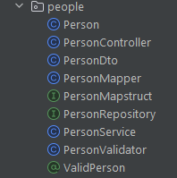

# Spring Boot Quick CRUD Base Package Project Template
This project is a Spring Boot application that uses Maven for dependency management. It includes a base package that provides foundational classes and utilities to streamline and speed up development and ensure consistency across the application.

these are the main features of the base package:
- quick and easy setup of new entities, DTOs, repositories, services, controllers, and mappers with minimal boilerplate code, making new CRUD operations a breeze.
- common methods and utilities for CRUD operations, auditing, error handling, and more.
- extensible and customizable base classes that can be easily extended or overridden to meet specific requirements.
- reduced development time and effort by eliminating repetitive tasks and providing a solid foundation for building new features.
- easy integration with other libraries, frameworks, and tools to enhance functionality and performance.
- scalability and flexibility to adapt to changing requirements and evolving technologies in a fast-paced environment.
- handle exceptions and errors in a consistent and standardized way.
- handle security, authentication, and authorization in a secure and reliable manner.
- support internationalization, localization, and other language-specific features.
- provide logging, monitoring, and reporting capabilities to track and analyze application behavior.
- ensure data integrity, consistency, and reliability by enforcing constraints, validations, and best practices.
- soft delete capability for entities that need to be marked as deleted without actually removing them from the database.
## How to use the base package Classes

All the classes leverage generics with type constraints to provide a flexible and reusable solution that can be easily adapted to different entities and use cases,
the generic types are the following:
- E: the entity type (E must be a subclass of BaseEntity)
- D: the DTO type (D must be a subclass of BaseDto)
- I: the primary key type (I must be a subclass of Serializable)
- R: the repository type (R must be a subclass of BaseRepository)

### First steps

add this dependency to your pom.xml file:
```xml
<dependency>
    <groupId>com.github.omaraouini</groupId>
    <artifactId>spring-boot-quick-crud</artifactId>
    <version>0.0.1-SNAPSHOT</version>
</dependency>
```

In the spring-boot-maven-plugi add this section to allow the lombok plugin to work as expected:
```xml
<build>
  <plugins>
    <plugin>
      <groupId>org.springframework.boot</groupId>
      <artifactId>spring-boot-maven-plugin</artifactId>
      <configuration>
        <excludes>
          <exclude>
            <groupId>org.projectlombok</groupId>
            <artifactId>lombok</artifactId>
          </exclude>
        </excludes>
      </configuration>
    </plugin>
  </plugins>
</build>
```

add the @EnableJapAuditing and @ComponentScans annotations to your main class, example:
```java
@EnableJpaAuditing
@ComponentScans({
        @ComponentScan("com.github.omaraouini.quickcrud.base")
        //@ComponentScan("your.base.package.path")
})
@SpringBootApplication
public class Application {

  public static void main(String[] args) {
    SpringApplication.run(Application.class, args);
  }
}
```
#### ***Note:***
Dont forget to add the @ComponentScan annotation to your base package path, as shown in the example above in the commented part.

### BaseEntity
base entity class used to define the common attributes of all entities that need to be saved in the database,
all the entities in the application that need to be saved should extend this class to inherit the common attributes and methods.
<br>The BaseEntity class uses the @MappedSuperclass annotation to indicate that it is not an entity itself but provides common attributes and methods for other entities.

It will provide by default the following fields:
- id: the primary key of the entity.
- deleted: a flag indicating whether the entity has been soft-deleted.

Example usage:
```java
  @Entity
  @Table(name = "people")
  @SQLDelete(sql = "UPDATE people SET deleted = true WHERE id=?")
  @Where(clause = "deleted=false")
  @SuperBuilder
  @Getter
  @Setter
  @NoArgsConstructor
  @AllArgsConstructor
  public class Person extends BaseEntity<Integer> {
      private String name;
      private String surname;
      private Integer age;
  }
 ```

## BaseEntityAuditable
The BaseEntityAuditable class is a generic base class for all entities in the application that require auditing. It extends the BaseEntity class and adds fields for createdBy, updatedBy, createdAt, and updatedAt.
it will provide by default the following fields (in addition to the fields provided by BaseEntity):
- createdBy: the user who created the entity.
- updatedBy: the user who last updated the entity.
- createdAt: the date and time when the entity was created.
- updatedAt: the date and time when the entity was last updated.

Example:
```java
  @Entity
  @Table(name = "people")
  @SQLDelete(sql = "UPDATE people SET deleted = true WHERE id=?")
  @Where(clause = "deleted=false")
  @SuperBuilder
  @Getter
  @Setter
  @NoArgsConstructor
  @AllArgsConstructor
  public class Person extends BaseEntityAuditable<Integer> {
      private String name;
      private String surname;
      private Integer age;
  }
```

### BaseCodeEntity
The BaseCodeEntity class is a generic base class for all entities in the application that have a code field. It extends the BaseEntity class and adds a code field, as well as methods for generating and validating codes.
it will provide by default the following fields (in addition to the fields provided by BaseEntity):
- code: a unique code for the entity.
- description: a description of the code.

<br>
This class is useful for entities that have a code field that needs to be generated automatically or validated against a specific pattern, such as en enumeration or a sequence,
or to store some custom business logic codes.

example usage:

```java
  @Entity
  @Table(name = "products")
  @SQLDelete(sql = "UPDATE products_codes SET deleted = true WHERE id=?")
  @Where(clause = "deleted=false")
  @SuperBuilder
  @Getter
  @Setter
  @NoArgsConstructor
  @AllArgsConstructor
  public class ProductCodeEnumValue extends BaseCodeEntity<Integer> {
    
  }
```

You either extend this class or BaseEntity or BaseEntityAuditable based on your requirements, depending on whether you need auditing fields or not.

### BaseDto
The BaseDto class is a generic base class for all Data Transfer Objects (DTOs) in the application. It provides a common structure and can include methods that are shared across all DTOs.
the class has the following fields:
- id: the primary key of the entity.

Example:
```java
  @SuperBuilder
  @Getter
  @Setter
  @NoArgsConstructor
  @AllArgsConstructor
  public class PersonDto extends BaseDto<Integer> {
      private String name;
      private String surname;
      private Integer age;
  }
```
example json response:
```json
{
  "id": 1,
  "name": "John",
  "surname": "Doe",
  "age": 30
}
```

### BaseDtoAuditable
The BaseDtoAuditable class is a generic base class for all Data Transfer Objects (DTOs) in the application that require auditing. It extends the BaseDto class and adds fields for createdBy, updatedBy, createdAt, and updatedAt.
the class has the following fields (in addition to the fields provided by BaseDto):
- createdBy: the user who created the entity.
- updatedBy: the user who last updated the entity.
- createdAt: the date and time when the entity was created.
- updatedAt: the date and time when the entity was last updated.

Example:
```java
  @SuperBuilder
  @Getter
  @Setter
  @NoArgsConstructor
  @AllArgsConstructor
  public class PersonDto extends BaseDtoAuditable<Integer> {
      private String name;
      private String surname;
      private Integer age;
  }
```

example json response:
```json
{
  "id": 1,
  "name": "John",
  "surname": "Doe",
  "age": 30,
  "createdBy": "admin",
  "updatedBy": "admin",
  "createdAt": "2021-10-01T12:00:00",
  "updatedAt": "2021-10-01T12:00:00"
}
```

### BaseRepository
The BaseRepository interface defines common methods for all repositories in the application. It extends JpaRepository, QueryByExampleExecutor, and JpaSpecificationExecutor to provide a wide range of data access capabilities.

```java
  @Repository
  public interface PersonRepository extends BaseRepository<Person, Integer> {
  }
   ```

### Repository Specification package
The Specification package provides a set of classes and utilities for building dynamic queries using JPA Criteria API. It allows you to define complex search criteria and filter conditions at runtime, without hardcoding them in the repository methods.

#### ExampleSpecification
The ExampleSpecification class is a generic base class for building dynamic queries using JPA Criteria API. It provides common methods for defining search criteria and filter conditions based on the entity attributes.

```java
Example<Person> example = Example.of(new Person("john", "doe"), ExampleMatcher.matching().withIgnoreCase());
ExampleSpecification<Person> exampleSpecification = new ExampleSpecification<>(example);
List<Person> people = personRepository.findAll(exampleSpecification);
```

#### SearchFieldCriteria
The SearchFieldCriteria class is a generic base class for building dynamic queries using JPA Criteria API. It provides common methods for defining search criteria and filter conditions based on the entity attributes.

```java
SearchFieldCriteria<Person> criteria = new SearchFieldCriteria<>();
criteria.add("name", "john", SearchOperation.EQUAL);
criteria.add("age", 30, SearchOperation.GREATER_THAN_OR_EQUAL);
List<Person> people = personRepository.findAll(criteria);
```

#### SearchOperation
The SearchOperation enum defines common search operations that can be used to build dynamic queries using JPA Criteria API. It includes operations such as EQUAL, NOT_EQUAL, GREATER_THAN, LESS_THAN, LIKE, and more.

```java
public enum SearchOperation {
    EQUAL,
    NOT_EQUAL,
    GREATER_THAN,
    LESS_THAN,
    GREATER_THAN_OR_EQUAL,
    LESS_THAN_OR_EQUAL,
    LIKE,
    NOT_LIKE,
    IN,
    NOT_IN,
    IS_NULL,
    IS_NOT_NULL,
    BETWEEN,
    NOT_BETWEEN
}
```

#### GenericSearchSpecification
The GenericSearchSpecification class is a generic base class for building dynamic queries using JPA Criteria API. It provides common methods for defining search criteria and filter conditions based on the entity attributes.
Example usage with a repository with a default method:
```java
public interface PersonRepository extends JpaRepository<Person, Integer> {
       default List<Person> findNameEqualTAndAgeGreaterThan(String name, Integer age) {
       GenericSearchSpecification<Person> specification = new GenericSearchSpecification<>();
       specification.add(new SearchFieldCriteria("name", name, SearchOperation.EQUAL));
       specification.add(new SearchFieldCriteria("age", age, SearchOperation.GREATER_THAN));
       return this.findAll(specification);
       }
       }
```
Most of the search operation can be done using this GenericSearchSpecification class, but if you need more complex queries you can use the ExampleSpecification or SearchFieldCriteria classes.
For more info refer to the JavaDoc of each class.

### BaseCrudService
The BaseCrudService class is a generic base class for all services in the application.
<br> It will provide CRUD automatically for all entities that extend BaseEntity or BaseEntityAuditable.
It provides common methods for creating, reading, updating, and deleting entities, as well as searching, filtering, and sorting entities based on various criteria.

```java
    @Service
    public class PersonService extends BaseCrudService<Person, PersonDto, Integer, PersonRepository> {
        public PersonService(PersonRepository repository, PersonMapper mapper) {
          super(repository, mapper);
         }
   }
```

In case you need to override the default methods to add some custom logic, you can override the methods in the service class.

```java
    @Service
    public class PersonService extends BaseCrudService<Person, PersonDto, Integer, PersonRepository> {
        public PersonService(PersonRepository repository, PersonMapper mapper) {
          super(repository, mapper);
         }
         
         @Override
         public PersonDto post(PersonDto dto) {
            // add custom logic here before the entity is saved
            var res = super.create(dto);
            // add custom logic here after the entity is saved
             // return res;
         }
   }
```
### BaseRestController
The BaseRestController class is a generic base class for all REST controllers in the application. It provides common methods for handling HTTP requests and responses, as well as exception handling and error reporting.
This class has the following methods:
- get: a method that returns a page of entities based on the search criteria and pagination parameters
  > /api/v1/{entity}?page={page}&size={size}&sort={sort}&direction={direction}&search={search}
- get: a method that returns an entity by its id
  > /api/v1/{entity}/{id}
- put: a method that updates an entity by its id
  > /api/v1/{entity}/{id}
- post: a method that creates an entity</li>
  > /api/v1/{entity}
- delete: a method that deletes an entity by its id
  > /api/v1/{entity}/{id}

```java
    @RestController
    @RequestMapping("/api/v1/people")
    @Tag(name = "People")
    public class PersonController extends BaseRestController<Person, PersonDto, Integer, PersonService> {
        public PersonController(PersonService service) {
            super(service);
        }
    }
```

Again, in case you need to override the default methods to add some custom logic, you can override the methods in the controller class.

```java
    @RestController
    @RequestMapping("/api/v1/people")
    @Tag(name = "People")
    public class PersonController extends BaseRestController<Person, PersonDto, Integer, PersonService> {
        public PersonController(PersonService service) {
            super(service);
        }
        
        @Override
        public ResponseEntity<PersonDto> post(@RequestBody PersonDto dto) {
            // add custom logic here before the entity is saved
            var res = super.post(dto);
            // add custom logic here after the entity is saved
            return res;
        }
    }
```

#### ***Note:***
Refer to the Swagger documentation for more details on the API endpoints and request/response formats.

### BaseExceptionHandler
The BaseExceptionHandler class is a generic base class for all exception handlers in the application. It provides common methods for handling exceptions and generating error responses, as well as logging and reporting errors.
in case you need to create a custom exception handler, you can extend this class and add your custom logic.

```java
    import org.springframework.web.bind.annotation.RestControllerAdvice;

@RestControllerAdvice
public class CustomExceptionHandler extends BaseExceptionHandler {
  @ExceptionHandler(CustomException.class)
  public ResponseEntity<ErrorResponse> handleCustomException(CustomException ex) {
    return super.handleException(ex, HttpStatus.BAD_REQUEST);
  }
}
```

### BaseMapper
The BaseMapper interface defines common methods for all mappers in the application. It provides methods to map between entities and DTOs, as well as lists of entities and DTOs. <br>
this example use a builder mapping, but you are free to use any mapping method you want, eg: mapstruct, modelmapper, etc.):
```java
    public class PersonMapper implements BaseMapper<Person, PersonDto, Integer> {
          @Override
          public PersonDto mapFrom(Person entity) {
          return PersonDto.builder()
                         .id(entity.getId())
                         .name(entity.getName())
                         .surname(entity.getSurname())
                         .age(entity.getAge())
                         .build();
          }
          @Override
          public Person mapFrom(PersonDto dto) {
          return Person.builder()
                         .id(dto.getId())
                         .name(dto.getName())
                         .surname(dto.getSurname())
                         .age(dto.getAge())
                         .build();
          }
          }
          
```

### ValidationMsgConst
Validation messages constants class used to define the common validation messages that need to be used in the application , example usage on the validation annotations on a Dto class field:
```java
@Size(max = 50, message = ValidationMsgConst.FIELD_MAX_CHARS)
@NotEmpty(message = ValidationMsgConst.FIELD_NOT_EMPTY)
private String name;
```
**Note:**
The validation messages that are inside the  resource bundle file (messages_*.properties) will be tranlated to the current locale of the application.

example of the messages_en.properties file:
```properties
entity-not-found=Entity not found
field-max-chars=maximum amount of chars is {max}
field-min-max-value=field need to be in a range between {min} and {max}
field-notEmpty=field cannot be empty
validation-errors=validation errors
```

#### Validation Annotations **(Optional)**
If you need to create custom validation annotations that are not provided by the standard javax.validation package, you can create your custom annotations and validators.
You can extend the BaseValidator class and override the validate method to add your custom validation logic.
<br>Example:
<br>Create a custom annotation under your entity package:
```java
@Target({ ElementType.TYPE })
@Retention(RUNTIME)
@Constraint(validatedBy = PersonValidator.class)
@Documented
public @interface ValidPerson {

    String message() default ValidationMsgConst.VALIDATION_ERRORS;

    Class<?>[] groups() default { };

    Class<? extends Payload>[] payload() default { };

}
```
Create a custom validator under your entity/domain type package:

```java
@Component
@Slf4j
public class PersonValidator implements ConstraintValidator<ValidPerson,PersonDto> {

    @Override
    public boolean isValid(PersonDto value, ConstraintValidatorContext context) {
        // add custom validation logic here
        return true;
    }
}
```

Use the custom annotation on your Dto class:
```java
@ValidPerson
public class PersonDto extends BaseDto<Integer> {
    private String name;
    private String surname;
    private Integer age;
}
```

As usual, you can create your custom validation messages by adding them to a resource bundle file under the resources/language folder.

## Wrapping up
1. Create a package for each entity that you want to create (by type of by domain is up to you), and inside this package create the following classes:
2. Entity class that extends BaseEntity or BaseEntityAuditable or BaseCodeEntity.
3. Dto class that extends BaseDto or BaseDtoAuditable.
4. Repository interface that extends BaseRepository.
5. Service class that extends BaseCrudService.
6. Controller class that extends BaseRestController.
7. Mapper class that implements BaseMapper.
8. Custom Exception classes that extends RuntimeException (optional).
9. Exception handler class that extends BaseExceptionHandler to handle the custom exceptions (optional).
10. Constants class that defines specific constants for the entity (optional).
11. Validation messages constants class that defines specific validation messages for the entity (optional).
12. Messages resource bundle file that contains the validation messages for the entity (optional).

Example of a package structure: <br>



By using these base classes, you can reduce boilerplate code and ensure consistency across your application. You can also take advantage of the common methods and utilities provided by the base classes to streamline development and improve code quality.

## Conclusion
The base package in this project provides a set of foundational classes and utilities that can be used to streamline development and ensure consistency across the application. By extending or implementing these base classes in your specific classes, you can reduce boilerplate code, improve code quality, and greatly accelerate development.